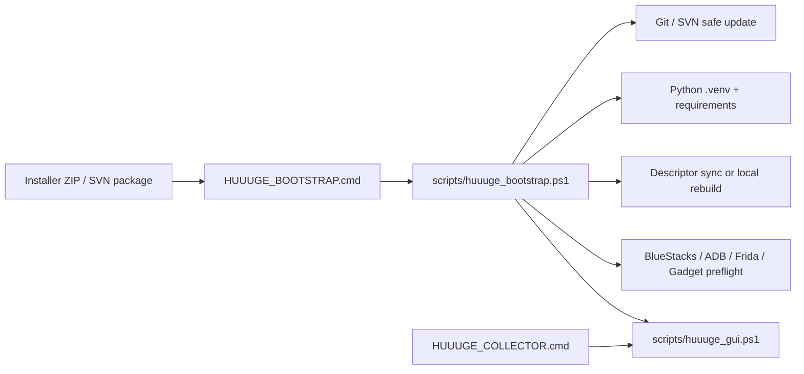
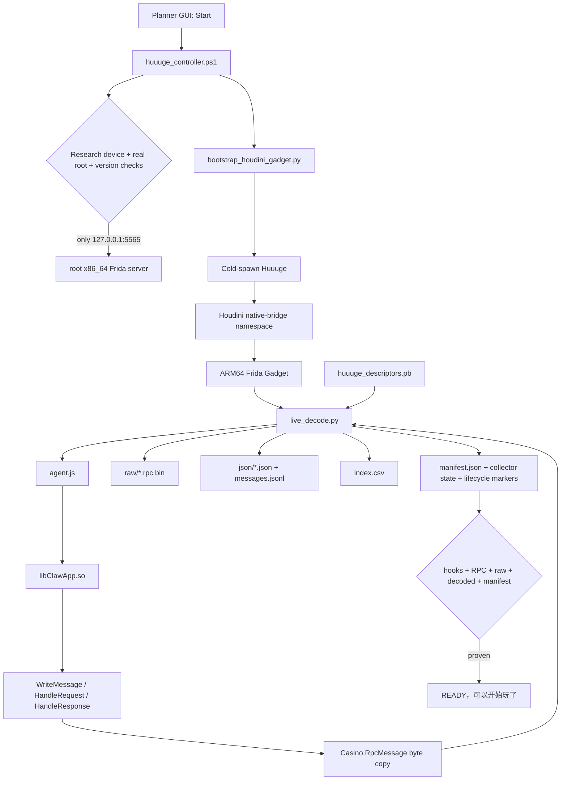
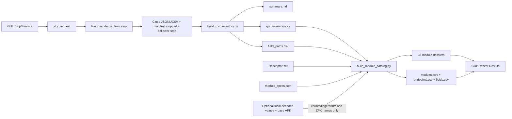

# Collector Data Flow

本文记录 Huuuge Collector 当前已经实现的数据流。它描述部署、采集、解码、整理和安全边界，不包含新增实现方案。

## 1. 部署与启动流



Bootstrap 不自动执行首次 Root/host patch。新电脑上的 SVN 认证、游戏登录、独立研究模拟器建立和机器级变更必须显式授权。

## 2. Runtime 采集与解码流



关键约束：

- Hook 复制客户端已经序列化/解密的对象，不修改对象、请求或服务端状态。
- console filter 只过滤终端显示，不过滤持久化数据。
- LZ4 payload 在 descriptor 解码前尝试解压；失败原因保留在记录中。
- `index.csv`、JSON 和 raw 文件可能含本地路径、账号/会话字段或业务值，只能留在本机受控目录。

## 3. Stop/Finalize 与后处理流



`build_module_catalog.py` 可以在本地读取 decoded values 计算 populated/nonempty/distinct/variability，但提交产物只允许包含计数、类型、hash-derived 标签和结构关系，不包含值本身。

## 4. 数据分区

| 分区 | 示例 | 是否可进 Git | 是否可进策划 SVN |
| --- | --- | --- | --- |
| 本地敏感采集 | `raw/`、`json/`、`messages.jsonl`、`index.csv`、账号/会话字段 | 否 | 否 |
| 本地控制状态 | `.local/bootstrap/`、`.local/controller/`、进程日志 | 否 | 否 |
| 本地/受控 Runtime | APK、`.so`、Frida server/Gadget | 否 | 否 |
| Schema-only Runtime | `huuuge_descriptors.pb` | Git 忽略；可在本地同步 | 允许由 safe publisher 携带 |
| 脱敏结构产物 | RPC aggregate、field paths、module dossiers/tables | 审阅后允许 | 仅 allowlist 中的必要文件 |
| 工程文档与脚本 | Git 源码、架构、协作记录 | 是 | 仅 safe allowlist |

## 5. 当前未存在的数据流

以下链路尚未实现，不能画成当前能力：

```text
raw/decoded Session
  -X-> stable normalized fact/event store
  -X-> module-specific numerical extractor
  -X-> automatic Excel/chart/report delivery
```

此外，当前 marker 只记录采集器生命周期。GUI 不要求策划选择模块或手工标注动作；业务上下文主要依赖时间、service/method、payload type 和字段结构推断。
