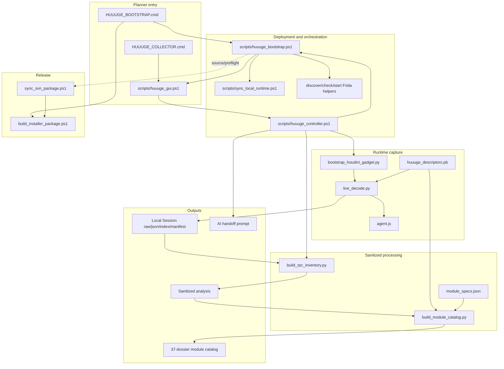
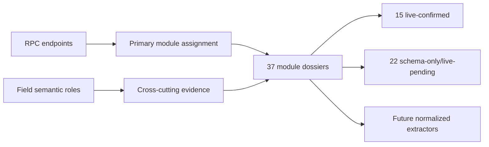

# Collector Module Map

本文描述采集器软件模块之间的调用、数据和所有权关系。`artifacts/module_catalog/` 中的 37 个游戏系统 dossier 是下游分析域，不是 37 个运行时进程或软件组件。

## 软件关系图

## 模块职责

| 模块 | 责任 | 主要输入 | 主要输出 | 当前状态 |
| --- | --- | --- | --- | --- |
| `HUUUGE_BOOTSTRAP.cmd` | 首次安装/更新入口 | 解压目录、SVN 环境 | 安装目录与 GUI | 已验证 |
| `HUUUGE_COLLECTOR.cmd` | 日常 GUI 入口 | 已部署目录 | GUI 进程 | 已验证 |
| `huuuge_bootstrap.ps1` | source update、venv、runtime sync、environment preflight | Git/SVN、Python、BlueStacks/ADB | `.local/bootstrap` 报告、GUI readiness | 已验证 |
| `huuuge_gui.ps1` | 六操作策划界面与状态展示 | settings、controller state | Controller action、日志、Recent/Guide | 已验证 |
| `huuuge_controller.ps1` | 采集生命周期总编排和安全关卡 | GUI action、环境、settings | active/last state、Session、后处理结果 | 已验证 |
| `discover_bluestacks.ps1` / `check_device.ps1` | 环境发现与只读设备检查 | Registry、ADB serial | 脱敏环境事实 | 已验证相关路径 |
| `start_frida_server.ps1` | 在已验证 root 的研究环境启动匹配 server | ADB、local server binary | root x86_64 Frida server | 已验证 |
| `bootstrap_houdini_gadget.py` | 冷启动并复用 native-bridge namespace 加载 Gadget | research device、package、Gadget path | ARM64 Gadget endpoint | 已验证 |
| `agent.js` | Hook 三个高层 RPC 点并复制 wrapper bytes | `libClawApp.so` ARM64 view | Frida `rpc` / status messages | 已验证 |
| `live_decode.py` | wrapper/payload decode、Session 持久化、state/manifest/marker | Gadget、agent、descriptor | local raw/JSON/index/manifest | 已验证 |
| `build_rpc_inventory.py` | 生成不含值的 RPC 与字段路径汇总 | local Session | sanitized summary/CSV | 已验证 |
| `build_module_catalog.py` | 组合 schema/live/static evidence | descriptor、inventory、fields、specs；可选 Session/APK | 37 dossiers 与三张结构表 | 已验证 |
| `module_specs.json` | 模块边界、pattern、证据和下一动作声明 | 人工维护规范 | catalog builder 分类输入 | 现有规范 |
| `build_descriptors.py` | 从 recovered `.proto` 生成 descriptor | 完整 proto source set | `huuuge_descriptors.pb` | 脚本存在；Git 默认输入缺失 |
| `build_installer_package.ps1` | 生成四文件安装 ZIP 与 hash manifest | release docs/launcher/version | Installer ZIP | 已验证 |
| `sync_svn_package.ps1` | 按 safe allowlist 镜像策划包 | 干净 Git 源、local descriptor | SVN working-copy changes | 已验证；脚本不自动 commit |

## 关键耦合点

1. Controller 是运行时中枢：它直接知道固定 device、package、descriptor、Gadget、collector、inventory 和 catalog 路径。
2. `live_decode.py` 同时承担 transport attach、decode、Session writer 和 readiness state；尚未拆分成独立库。
3. Catalog Builder 同时消费 committed sanitized tables 和可选 local value-bearing Session；安全依赖“只输出计数/结构”的实现与审阅。
4. Descriptor 是 Capture 与 Catalog 的共同 schema backbone；目前 Git checkout 本身还不能保证重建它。
5. GUI 只依赖 Controller 的 `.local` state，不直接操作 ADB/Frida/Session 文件。
6. Release Publisher 与工程主链分离：Git 是工程真相源，SVN 是策划发布面。

## 下游游戏域关系

Endpoint 只分配一个 primary module；economy、reward 等 cross-cutting 字段可以同时出现在多个 dossier。目录状态代表结构证据成熟度，不代表数值模型已经完成。
