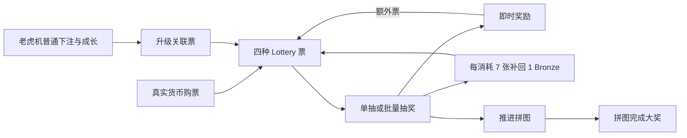

# Lottery 玩法与逻辑

本页用策划语言说明活动循环和已确认边界；协议定位统一放在 Evidence Matrix。

## 玩家循环

对应的玩家体验是：

- 通过真实货币购票、累计补回、抽奖奖励和升级关联奖励获得票；
- 选择 Bronze、Silver、Gold 或 Black 进行单抽或批量抽；
- 获得筹码和其他即时奖励，部分结果推进拼图；
- 拼图完成后领取大奖；
- 额外票与累计补回票继续进入下一轮。

## 票的四类直接来源

- **已确认：真实货币购票。** 四次成功购买共支付 54.43 SGD，获得 763 张票和 235 点忠诚度。
- **已确认：累计消耗补回。** 每累计消耗 7 张任意票补回 1 张 Bronze，本次补回 133 张。
- **已确认：抽奖直接奖励。** 本次抽奖奖励给出 60 张票。
- **本次样本观察：升级关联。** 六次升级后出现合计 16 张 Bronze 的余额增长；余额变化已确认，具体发放动作仍待界面证据验证。

普通筹码下注本身没有出现直接发票字段，因此本报告不把升级关联奖励写成“每局随机掉票”。

## 抽奖与批量消耗

- 本次 346 次抽奖全部成功返回结果。
- 343 次为单抽；3 次 Bronze 批量抽分别消耗 90、150、350 张。
- 本次实际最大批量为 350 张；当前配置允许的批量上限为 2000 张。实际操作量与配置上限是两个不同概念。
- 四种票都可以推进同一个累计补回进度。

## 累计补回

本次开始进度为 1，累计消耗 933 张票，补回 133 张 Bronze，结束进度为 3。该规则是确定性的票数循环，不是随机奖励，也不是货币返还。

## 即时奖励与拼图

即时奖励包括筹码、额外票、拼图进度、收藏箱、加速和 Charms token。拼图进度达到完成条件后会再发放完成大奖。

本次记录到 Bronze 拼图完成 4 次、Gold 拼图完成 1 次。由于起始板面并非统一空板，当前不能推导固定单板成本。

批量抽后的结果回看会再次展示已有奖励；统计已去重，不把回看当成重复发奖。

## 下注与升级的边界

本次普通下注分为 1×、3.33×、6.67×、33.33×最低下注四档。升级关联票只出现在后两个阶段，但这些阶段同时包含不同等级、不同游玩时长和不同机器环境。

因此当前只能写：

- **已确认：**六次升级后出现合计 16 张 Bronze 的余额增长；
- **待验证：**更高下注可能通过更快推进成长而间接提高单位时间内的升级奖励频率；
- **不能确认：**更高下注会直接提高每次 Spin 的 Lottery 票掉落率。

## 付费边界

“付费、充值、购买”只表示玩家使用真实货币完成交易。本次只有四次真实货币购票属于付费行为；588 次 Spin 是普通筹码下注。

四个票包都额外包含忠诚度点数，所以礼包总价不能全部归因给票。详细见 `PURCHASES.csv` 和主报告“本次充值与购票记录”。
