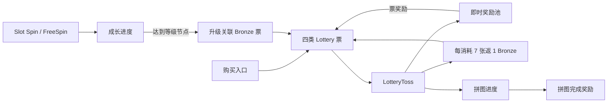

# Lottery 玩法与逻辑链路

## 观测链路

## 1. 票的进入方式

- **[Confirmed · L3]** 购买发放：四次完成的购买链路共发放 763 张，四类票均有样本；解码证据没有实际货币价格。
- **[Confirmed · L3]** 消耗返还：任意颜色票的消耗都计入同一进度，阈值为 7，返还 Bronze。
- **[Confirmed · L3]** Lottery 奖励：即时奖励池可再次给票，本次共 60 张。
- **[Estimate · L3]** 升级关联：六次等级变化之后余额增加 16 张 Bronze，且不能由前三类来源解释。
- **[Manual · L0]** 用户现场指出部分 Lottery 道具由升级发放。该信息用于解释方向，不单独提升证据等级。

## 2. LotteryToss 消耗

- 单抽 343 次；批量抽 3 次。
- 实际最大批量为 350；Config 上限为 2000。前者是 Runtime 事实，后者是当前配置能力，二者不能混用。
- 所有 346 个请求都找到状态正常的响应。
- 本次 `lottery multiplier` 固定为 level 1 / multiplier 1；不能据此判断其他等级是否存在或如何触发。

## 3. 奖励层

即时奖励包含筹码、拼图进度、票、收藏箱、加速和 Charms token。拼图完成奖励通过 state 单独返回；结果 readback 只是回读，不重复计奖。

奖励池可见变体数量，但当前 payload 没有权重。Runtime 命中率是样本统计，不是配置概率。

## 4. 进度层

免费票进度可由公式完整复算：

`floor((初始进度 1 + 消耗 933) / 7) = 133`，余数为 3。

拼图进度本次只证明了“即时奖励可以推进拼图、完成后发放大额奖励”。由于缺少初始板面和目标值，不推导稳定完成成本。

## 5. Spin 与升级的边界

Spin/FreeSpin 的返回结构中没有 Lottery 票 grant。升级关联票是通过时间顺序和前后票余额总账识别的：在等级变化后出现余额增量，且购买、免费进度、Lottery 直接奖励都无法解释。

因此报告采用两层口径：

1. “六次升级后出现 +16 Bronze”是可复核的状态变化；
2. “这些票由升级奖励发放”是高可信 Estimate，仍需 UI 奖励弹窗或显式 reward payload 完成 L4 三角验证。

## 6. 返还规律

- 票层：933 张消耗产生 133 张阈值返还，名义返还率为 14.25%；这是当前 Session 的精确机制结果。
- 奖励层：直接筹码与拼图完成合计 1,007,033.92 B0。
- 成本层：588 次付费 Spin 共消耗 8569.33 B0；另有四次付费票获取，但价格缺失。

所以 `117.516 ×` 只能描述“观测 Lottery 筹码输出 / 观测 Spin 筹码成本”，不能用于商业化回收、RTP 或玩家净收益判断。
