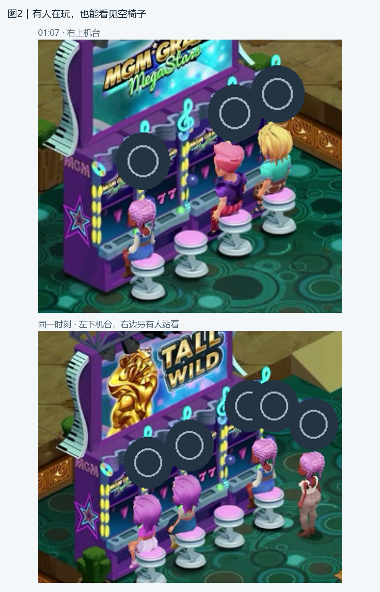
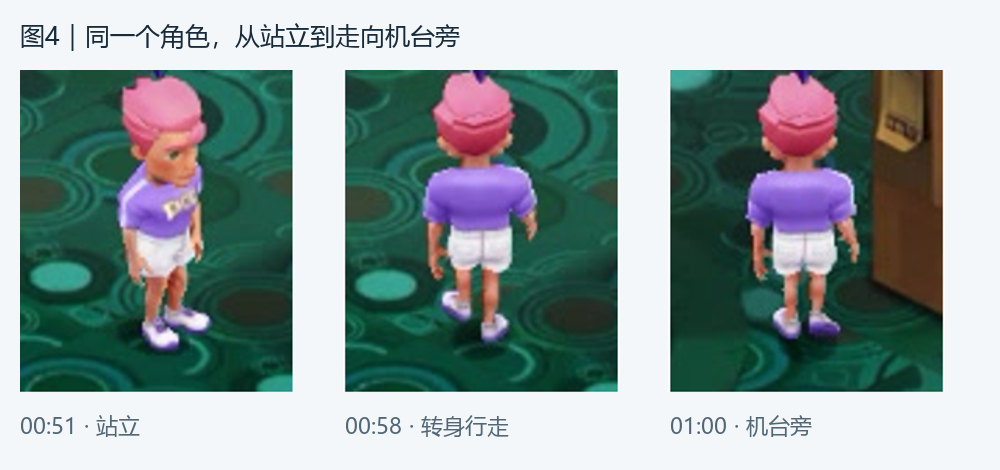
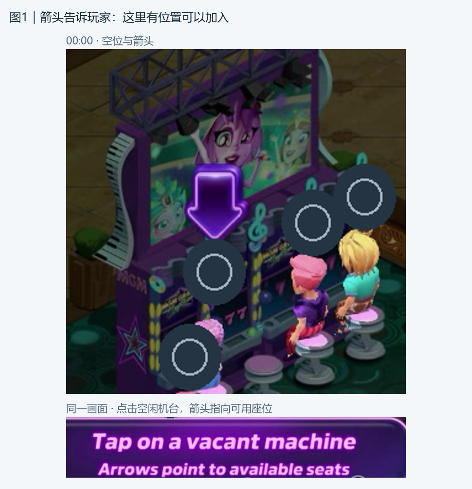
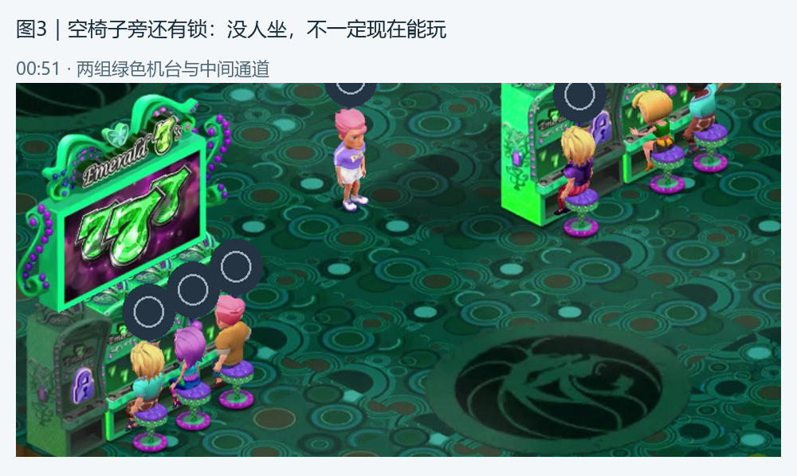
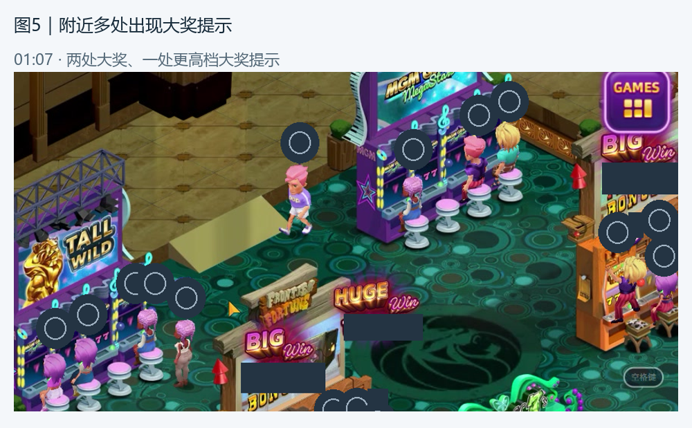

# Pop! Slots 大厅氛围拆解｜策划阅读版

Pop 大厅最值得借鉴的，是让“有人在玩、有人在走、附近有人中奖”同时出现在玩家眼前。机台因此像一处正在营业的场所，玩家也更容易产生“我可以走过去一起玩”的感受。

本篇围绕一段约一分钟的录屏说明画面与体验。此前研究认为，Pop 很可能用机器人补充大厅人数。但具体哪些角色是机器人，以及如何补位、让座，目前还没有确认。

## 一、大厅为什么显得热闹

画面里的热闹有三种来源：机台前坐着人，机台之间有人停留或走动，附近又会出现醒目的中奖提示。三者同时出现，让人觉得大厅里的活动一直在继续。

对玩家来说，坐着的人说明“这里有人玩”，走动的人让场景有变化，中奖提示则把视线引向某个机台。这是对画面可能带来感受的理解；本次没有玩家访谈或效果数据。

值得借鉴的是把热闹分散到机台和通道之间。只增加人数，未必就能得到同样的感觉；如果入口难找、画面过满，热闹也可能变成干扰。

## 二、人围着机台，空位也看得见

图2｜01:07。上、下两组机台都能看到四把椅子，其中三处有人坐、一处空着；下图右侧还站着一名角色。站在旁边的人不算占了椅子。

这种摆放能同时传达两件事：“这里受欢迎”和“还有位置可以加入”。人物集中在机台周围，中间仍有可以走动的空间，玩家不用从一大片杂乱的人群中寻找入口。

但这只是当时看见的两组机台，不能写成 Pop 全大厅始终保持三人一空位，也不能据此判断谁是真人、谁是机器人。值得讨论的是所需的热闹程度与加入感，而不是照抄一个固定人数。

## 三、人物会动，场景才像在持续发生事情

图4｜00:51、00:58、01:00。粉发、紫色上衣的角色先站着，随后转身行走，再来到棕色机台旁。连续画面中，发型和服装保持一致。

相比所有人都坐着不动，这样的变化容易让玩家感觉有人正在找游戏、换位置或经过大厅。人物走动与坐在机台前的人并置，也让画面有了不同的节奏。

这段画面没有看到该角色接着落座。它不能证明角色一定会按“走一会儿、坐下来玩、再离开”的固定顺序循环，更不能确认这名角色就是机器人。

可借鉴的是让活动自然错开，让玩家看得懂一个人刚才在哪里、现在去了哪里。各类人物停留多久、是否总要坐下，仍需要结合自己的大厅体验讨论。

## 四、空椅子还不够，要让人知道哪里能玩

图1｜00:00。箭头指向机台前的空位，下方引导文字的意思是“点击空闲机台，箭头会指向可用座位”。画面把下一步操作与具体位置放在一起。

玩家进入热闹大厅后，仍然需要很快找到自己的入口。箭头提供了明确的行动方向，减少在机台和人物之间反复寻找的负担。

图3｜00:51。两组绿色机台各能看到三人坐着和一把空椅子；空位对应的面板还有锁图标，中间留着通道。

这提醒我们把“没人坐”与“我现在能玩”分开看。图3里的空椅子能否让当前玩家进入，尚未确认。借鉴时值得优先讲清可玩的机台、尚未解锁的机台，以及对应入口，避免玩家走过去才发现进不去。

本次也没有看到点击有人坐的椅子后发生什么，因此不能把排队、让座或自动换位置当成 Pop 已确认的规则。

## 五、附近有人中奖，机台就更容易吸引注意

图5｜01:07。同一画面能看到两处 BIG WIN（大奖）和一处 HUGE WIN（更高档大奖）提示。头像细节和金额已遮盖，保留了提示与机台的位置关系。

中奖提示把“有人在玩”进一步表现成“这里正在发生值得注意的事”。玩家在大厅走动时，也能从旁边机台获得反馈，而不必先进入那个游戏。

可以借鉴这种让周围玩家看见热闹的方式，同时讨论提示出现的位置、大小和频繁程度。提示过密可能盖住空位或抢走玩家对主入口的注意。这里看见的是中奖提示，是否对应真实游玩和奖励、多久发生一次，尚未确认。

图6｜00:51与00:55。同一机台上方的展示屏从“777”画面切到“10倍百搭倍率”的宣传画面。

展示屏变化也会让机台显得活跃，但它与人物游玩、实际中奖是不同的画面内容。借鉴时可以分别考虑“吸引走近的宣传”和“有人玩出了结果的反馈”；不能把展示屏换画面算成一次实际游玩或中奖。

## 六、值得借鉴的，是连贯的体验

| 可借鉴的地方 | 希望带给玩家的感受 | 需要一起考虑的代价 |
| --- | --- | --- |
| 机台前有人，通道里也有少量活动 | 大厅一直有人在使用 | 太拥挤会遮住空位和行走方向 |
| 可用空位有明确引导 | 我能很快找到地方加入 | 锁定空位不能让人误以为可玩 |
| 走动与坐着的人同时存在 | 每个人像有自己的事情 | 动作太整齐、外观反复出现，容易显得重复 |
| 中奖提示能被附近的人看见 | 周围也会发生令人兴奋的事 | 过多提示可能分散注意，遮挡操作 |

人物能不能让人相信“还是刚才那个人”，也值得讨论。本次短暂画面中可以追随同一外观的角色，但没有确认人物资料是否长期稳定。进入机台后旁边还是不是刚才那批人、回到大厅时他们是否还在，也没有确认。两点都与玩家是否相信自己身处同一个持续运转的大厅有关。

## 七、讨论前还要保留哪些问号

- 哪些人由机器人补充？人数不足时如何补上，玩家需要位置时又如何处理？
- 图中留空位的情况，在别处和其他时候是否仍然常见？空位是否确实可玩？
- 点击已有人坐的位置后会发生什么？走动的人接下来会不会坐下？
- 进入机台和返回大厅时，身边的人是否保持连贯？人物换天后是否仍是同一个身份？
- 大奖提示与实际奖励是什么关系，出现频繁程度如何？

这些问号不影响先讨论画面组织、加入感和反馈方式，但暂时不能用 Pop 为某套精确人数、等待时间或中奖规则背书。

资料说明：本篇使用已审阅的实机录屏画面与此前 Pop! Slots 研究。截图做了必要遮盖，画面观察、此前判断与尚未确认的内容分别说明。需要进一步查阅时，可见[原研究材料](POP_SLOTS_LOBBY_REPORT.md)。
