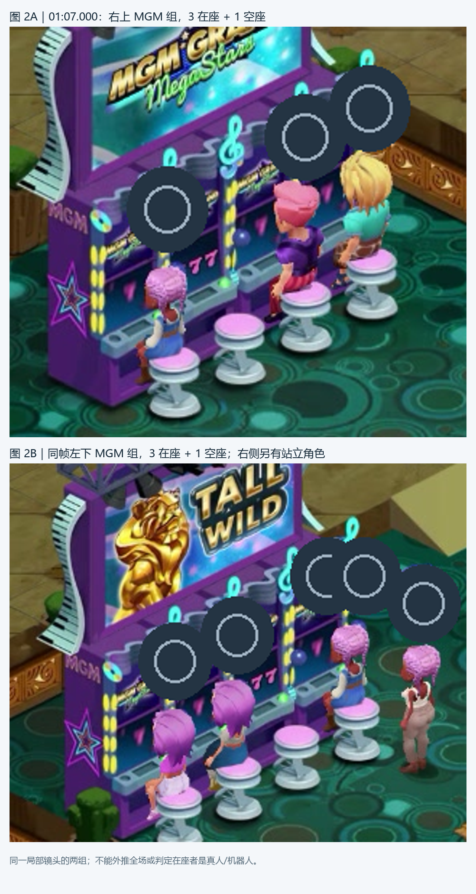
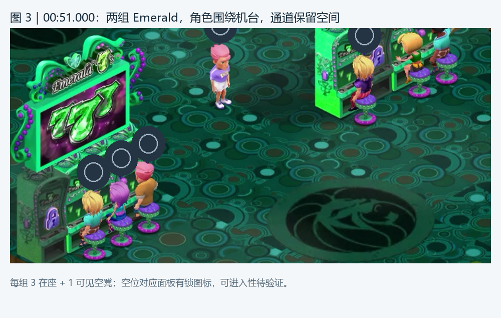
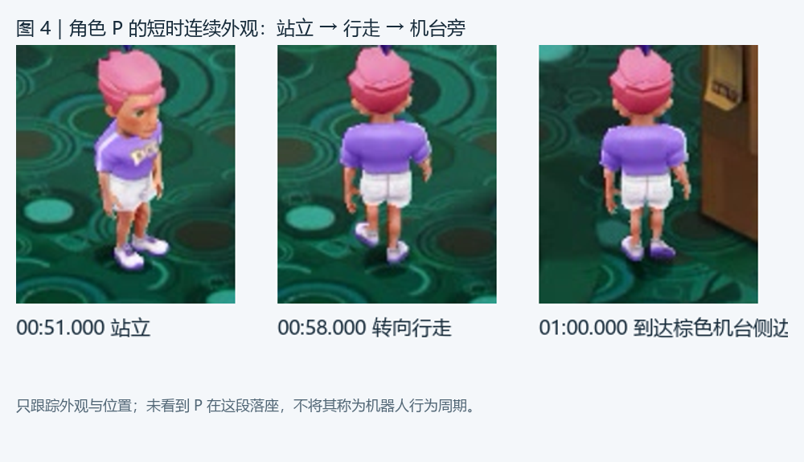
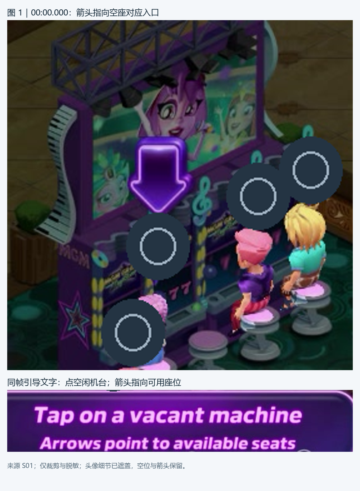

# Pop! Slots 大厅氛围系统拆解

**中文图文首版 · TASK-0030 · 2026-09-09 · Review，等待 ChatGPT 审阅**

用途：帮助系统策划讨论大厅氛围的体验价值与可借鉴内容。本稿基于已有研究和一段约 72 秒录屏，不是开发方案。配套：[离线阅读版](POP_SLOTS_LOBBY_REPORT.html) · [证据索引 CSV](EVIDENCE_MATRIX.csv) · [Review 交接](REVIEW_HANDOFF.md)。

## 1. 先看结论：热闹来自“有人在玩，也给我留了入口”

Pop 的可见优势，是把机台入口、在座角色、通道中的角色和中奖反馈放在同一空间里。玩家浏览大厅时，能同时看见“哪里有人”“哪里有空位”“哪里正在发生事情”。这些层次共同构成活跃感，不能只用一个总人数解释。[E01–E05、E11–E13]

**机器人存在性沿用 DSH 的高概率研究判断。** DSH 原报告给出的解释是“真实多人房间架构 + 服务器填充的模拟用户”，依据包括 Shaker 用户/行为符号、用户解析采样及数据分布；User 本轮补充确认 DSH 曾做过 Root、Frida 符号枚举和 `parseUserData` Hook 采样。它是有技术研究背景的判断，不是仅凭录屏猜测。但本轮可复核材料是原报告及视频，没有独立的 Hook 脚本、原始样本和身份真值，因此保留为 **DSH 原研究判断，本轮未独立复现**。具体哪个角色是机器人、谁调度、如何补位和让位，仍需分别举证。[E15–E18]

| 当前能用于讨论的结论 | 不能随之推出的结论 |
|---|---|
| 两组 MGM 局部截图均为 3 人在座、1 个空座；引导明确指向可用座位 | 所有机台、所有房间、所有时段恒定只空一个 |
| 两组 Emerald 有在座角色与可见空凳，空位面板带锁图标 | 空凳一定能被当前玩家使用 |
| 可跟踪角色 P 站立、转向、行走到机台附近 | P 是机器人，或已完成“入场—落座—游玩—离场”周期 |
| 数秒内可出现多个 BIG WIN / HUGE WIN 浮层 | 真实 Spin 次数、实际发奖、中奖概率或固定模拟间隔 |
| DSH 提供房间、用户、角色活动与坐席分配的技术线索 | 仅凭函数名就确认全量用户来源、补位阈值或主动让座算法 |

### 四种证据标签

- **直接观察**：本轮从视频可见内容核读；只对注明的画面、时间和对象成立。
- **原报告主张**：DSH 已记录的研究结论；注明本轮是否有底层资料可复核。
- **推断**：由观察形成的体验解释或设计启发，不表示后台实现已确认。
- **待验证**：现有资料未覆盖，或不足以排除其他解释；不是“功能不存在”。

## 2. 这段录屏实际覆盖了什么

S01 为 User 提供的 `pop.mp4`，约 **72.17 秒、996×558、30 fps**，解码完整；未检出音轨。录制版本、服务区、房间配置与角色控制身份未由本片确认。逐秒核读覆盖 00:00–01:12；01:05–01:11 的浮层片段另按 0.2 秒间隔核读。一般时序只能定位到秒级，浮层首见时刻精度为 0.2 秒，不冒称逐帧事件时间。[E01]

| 录屏区间 | 实际可见内容 | 研究边界 |
|---|---|---|
| 00:00–00:05 | 大厅空座引导、部分在座角色与中奖浮层 | 引导已经开始，不能测完整引导时长 |
| 00:06–00:17 | 加载、首页/机台卡片导航、锁定的活动入口 | 不是老虎机玩法内画面；不能当座位快照对照 |
| 00:18–00:20 | 回到大厅，出现选机台提示 | 是页面切换后的大厅画面；不证明跨界面同一房间 |
| 00:21–00:50 | P 在不同机台组、通道附近移动，镜头随之变化 | 机台背板会遮挡角色；无法由短时消失判定离场 |
| 00:51–00:57 | P 留在两组 Emerald 间，展示屏与在座动作变化 | 站立窗口不是完整停留周期 |
| 00:58–01:12 | P 再次移动，经过棕色/紫色机台；多处中奖浮层 | 未见 P 完成落座进入玩法及返回 |

本片能拼出的是“看大厅—浏览导航—回大厅—走动与观看氛围”，**完整的“选择座位—落座—进入玩法—退出—返回”尚未被本片覆盖**。[E02、E06、E09]

## 3. 人数与机台分布：围绕机台形成小聚集

**直接观察。** 图 2 的两组紫色 MGM 机台，各可辨认 4 个凳位，其中 3 人在座、1 个空座。左下组旁另有一名站立角色。图 3 的两组 Emerald 同样可见 3 人在座和 1 个空凳，但空位对应面板有锁图标。这里将“机台组”定义为一块连续背板及其一排坐席，避免把单个终端、座位和整组混算。[E03–E05]

| 样本 | 时间/画面位置 | 可辨认凳位 | 在座 | 空凳 | 单列的非在座角色 |
|---|---|---:|---:|---:|---|
| M1 | 01:07，右上 MGM | 4 | 3 | 1 | 通道中的 P 不计入座位 |
| M2 | 01:07，左下 MGM | 4 | 3 | 1 | 组旁 1 人站立，身份未知 |
| E1 | 00:51，左下 Emerald | 4 | 3 | 1 | 两组间 P 站立 |
| E2 | 00:51，右上 Emerald | 4 | 3 | 1 | 与 E1 共用同一画面中的 P，不重复加人 |

这是挑选清晰镜头得到的 **4 个组位样本**，不是随机抽样、全场普查或四个独立房间。两组 MGM 的合计 6 在座/2 空座，以及两组 Emerald 的合计 6 在座/2 空凳，只属于各自截图；不把不同时间的角色相加为全场人数。[E03、E04]

**能支持的结论。** 用户所说“看着每台只空一位”，在这些选取的局部样本中得到支持。人群主要贴近机器，通道仍留有可辨认的活动空间。[E03–E05]

**局限。** 遮挡、镜头边缘、锁定区域及未走到的区域未纳入；不能报全场人数、真人比例、机器人比例或占用率配置。没有拍到空组变有人，不能用静态分布证明补位机制。

**策划意义（推断）。** 先讨论机台前的聚集、通道中的少量变化、玩家入口的清晰程度，再讨论总人数。一个空凳的视觉状态与当前玩家是否有资格进入，应分开表达。

## 4. 角色行为与节奏：本片证明了局部动作，未证明完整循环

用 **P** 指代镜头反复跟随的粉发、紫色上衣、白色短裤角色。这只是观察别名；推测其为被操控角色，但不把该推测当机器人身份依据。[E06]

| 连续片段 | 观察结果 | 持续时间能否测量 |
|---|---|---|
| 00:51–00:57 | P 留在两组 Emerald 之间，姿态有变化 | 可说这一约 6 秒观察窗内未见位移；不能得出完整待机时长 |
| 00:58–01:00 | P 转向并向棕色机台侧边行走 | 可说约 2 秒的局部行走；不能当平均寻路时间 |
| 01:00–01:04 | P 经过棕色与紫色机台之间，局部有背板遮挡 | 不能把遮挡时段拼成落座或消失事件 |
| 01:05–01:11 | P 在 MGM 组附近走动；组旁还可见另一站立角色 | 未获得该站立角色从座位起身到离场的连续链 |

**能支持的结论。** 空间中的角色不是纯静态装饰；有可辨认的朝向、行走、站立和在座姿态。**尚不能证明**某个已识别机器人依次完成出现、走动、落座、游玩、庆祝、离座、换台或消失。[E06、E07]

**策划意义（推断）。** 有价值的借鉴是动作之间的连续感与角色在场景中的目的感。随机间隔、走动人数、停留时长和补位延迟均不能从这段片子反算成配置。DSH 的完整状态机留在附录作解释线索。

## 5. 空位与玩家入座：入口表达清楚，交互规则仍需补证

**直接观察。** 引导明确要求点击空闲机台，并说明箭头指向可用座位；箭头与空凳对应的终端处于同一位置关系。它让玩家把空位理解为“我的入口”。[E08]

| 需要拆清的操作 | 当前证据 | 可下结论 |
|---|---|---|
| 点击空位 | 有引导文字和箭头，缺清晰点击—落座—进入的完整链 | 确认引导意图；操作后是否等待未证实 |
| 点击有人椅子 | 未覆盖明确点击与反馈 | 排队、打开资料、拒绝、让位均待验证 |
| 点击整组机台/背板 | 片中有靠近机台与光标移动，不能可靠确认点击对象及因果 | 自动选座、目标分配规则待验证 |
| 走近有人机台 | P 可走过机台旁 | 不足以证明靠近会触发他人让座 |

**策划意义（推断）。** “看得见一个入口”“入口可立即使用”“点击已占座位的反馈”是三个不同问题。空座截图不能替代后两个操作证据。DSH §4 中主动让位等内容属于迁移建议，不能作为 Pop 已测行为引用。[E08、E10、E18]

## 6. 大厅与机台内一致性：本轮明确留空的主题

00:06–00:17 是加载和首页/导航画面；00:18 返回大厅。此片没有老虎机玩法内的同桌角色/座位视图，所以无法把进入前、机台内、返回后组成三联对照，也无法确认跨界面相同头像、相同座位或变化延迟。[E02、E09]

**原报告主张。** DSH 的房间用户和坐席相关符号，为持续维护房间成员与角色位置提供了研究线索。**缺失证据。** 没有本轮可复核的调用链或同一份座位数据在两个界面被使用的证据；即使未来看到相同头像，也只能先确认视觉连续性，不能直接确认后台“同一份快照”的实现。

**策划意义（推断）。** 讨论目标应是玩家进入、退出前后的“还是刚才那一桌”感受。数据如何同步、异常时如何回退，属于后续设计/实现确认，不由本报告替定。

## 7. 身份与资料连续性：可见外观连续，控制身份不可见

**直接观察。** P 在上述短时片段中保持相同外观；周边角色有多种发型、服装和头顶圆形资料标记，也有相近外观重复出现。公开配图已遮盖资料头像和地区标记，使用外观别名，不公布个人资料。[E06、E14]

**原报告主张。** DSH 依据用户解析数据中的编号聚集、地区集中、游客命名等现象，判断存在模拟用户。技术采样加强了这个假设的依据，但这些分布特征本身不是自动控制标签；有正常姓名也不能反向证明是真人。[E15、E16]

**局限。** 本片没有打开资料页，没有跨日重访，也未建立可靠的后台身份映射。不能确认资料字段全貌、身份库规模、机器人核心数据固定方式，或给每个在座者贴真人/机器人标签。

**策划意义（推断）。** 可讨论的价值是“再次遇见时能认出来、行为和外观衔接自然”。命名/地区的多样性建议与机器人存在性判断应分开；本轮不把伪装真人作为改进目标。

## 8. 游玩与中奖表现：高层浮层让远处的机器也有存在感

**直接观察。** 在 01:05–01:11 的 6 秒窗口内，按同一位置与持续可见内容去重，可辨认 **3 个浮层事件：2 个 BIG WIN、1 个 HUGE WIN**。右侧 BIG WIN 在 01:05.8 样本首见；另外两处在 01:06.8 样本首见，01:07 同屏可见三处。后二者在 0.2 秒采样精度下同窗出现，不表示服务器同帧触发。右侧浮层后来被画面边缘影响，不测其完整生命周期。[E11]

这个计数只针对选定窗口中的可见浮层，不是全片/全房间中奖次数。移动镜头、遮挡和窗口两端都会影响计数；不将 3÷6 外推为稳定触发率，更不计算中奖概率。事件金额已遮盖，不将画面数字当奖励到账依据。

00:37–00:40 还可见另一个多处中奖反馈片段；说明这些高层反馈并非只在唯一一帧出现，但不据此判定固定周期。[E12]

同一近景 Emerald 上方展示屏从 00:51 的 777 变为 00:55 的倍率宣传。它属于可见展示内容变化；不能直接当转轴 Spin 或结算事件。部分在座角色手臂姿态变化可见，但本轮未将动作与特定账号的结果一一对应。[E13]

**策划意义（推断）。** 远处也看得见的浮层，可以让“有人玩”转化为“那边发生了事”。密集时也可能争抢注意力；讨论时宜分清常态小动作、机器展示屏、短时大奖反馈三层，再判断是否遮住自己的入口。同步上限、间隔、概率和奖励逻辑均未测得。

## 9. 值得带去讨论的内容

| 讨论主题 | 本片提供的价值 | 讨论时应避免的跳跃 |
|---|---|---|
| 有人在玩，同时留出玩家入口 | 座位、角色、空位引导处于同一空间，关系直观 | 把 3+1 局部样本定成所有机台的固定规则 |
| 热闹的空间分层 | 机台前聚集、通道行走/站立、远处中奖浮层共同作用 | 只提高总人数，忽略空位资格、遮挡和通路 |
| 角色动作与短时连续性 | 玩家能跟随一个角色理解其移动目标 | 从 P 的行走推导机器人完整自动状态机 |
| 中奖反馈的可见性 | 未进入机器，也能感知别处正在游玩 | 把展示动画当真实经济数据，把同窗出现当统一调度 |
| 机器人研究的使用方式 | DSH 技术研究可作为高概率解释与后续验证线索 | 把原报告中设计建议、符号含义和实测行为混成事实 |

这些是讨论候选，不代表任何具体项目已采纳。具体原案对照另存获授权的私有讨论稿，本公共版本不带入项目参数或需求原图。

## 附录 A｜DSH 原研究：保留解释框架，逐项标明支持边界

原文件 `artifacts/toptycoon/POP_SLOTS_LOBBY_FORENSICS.md` 保持不变。读取基线为研究仓库 main@`7df687ec18f904e6c44ed5bfb05a7a6de30bb46c`，User 指定历史 ref `d7828f1`；原报告 blob `e09ad16d974dd617fdfffa20bbd5ec251e60bf96`。以下只转述必要技术线索，不重发其账号、姓名、余额或完整采样内容。

| 层/主张 | 原报告定位与线索 | 本轮支持程度 | 缺少什么 |
|---|---|---|---|
| 房间/用户层 | §1.1：`CRoomUsersManager`、`onUserJoined`、`parseUserData`、房间更新/合并相关符号 | 原报告记载；支持继续研究房间用户模型 | 符号所在版本、原始枚举及数据调用链；不能据名称证明所有用户唯一来源 |
| 角色行为层 | §1.2：Walk、Stand、WalkToSit、活动工厂、生命周期、`CSlotsFinder::sitUser` | 原报告记载；视频另证有站立/移动/在座 | 完整状态转换日志及角色对应；找席函数名不证明目标选择策略 |
| 模拟用户数据层 | §3：用户解析样本和资料分布 | DSH 判断存在填充机器人；本稿作为高概率工作假设保留 | 原始样本、字段映射、去重口径、自动控制标签或其他独立确认 |
| 全循环状态机 | §2：Stand → sitUser → Walk → Sit → Play → Celebrate → Stand | 原报告还原模型；本片只补强部分可见状态 | 同一已识别角色的完整周期；庆祝后必然起身也未证实 |
| 每台有人/不占满 | §2–3 结合符号和观察的解释 | 本片部分组有 3 在座/1 空位 | 空组到补齐的连续证据、动态条件、房间覆盖与阈值 |
| 真人优先/靠近让座 | §4 的移植建议与原则映射 | 不能归类为 Pop 操作实测 | 明确点击对象、角色身份和让座前后连续证据 |
| “五个破绽” | §5 的资料分布与机械行为建议 | 保留为 DSH 对研究样本的解释/建议 | 分布的采样背景、重复行为的时序测量；不能单凭地区/游客名判机器人 |

原报告称“29 个用户样本”，部分统计使用 28 为分母；本轮未找到可以解释该差异的底层样本，因此不重算比例、不修正原文。当前研究树及已有本机 `artifacts/scripts` 未找到独立的 Pop Hook 脚本/原始采样；此处“未找到”仅说明本轮访问范围。[E15–E18]

User 补充的历史技术环境为 x86_64 原生、Shaker/`libBigCasino.so`，曾在已 Root 环境进行 Frida 符号枚举及用户解析 Hook。**这些是历史研究说明，不是当前进程、设备、Hook 运行状态。** 本轮没有启动或复跑 Root、Frida、Hook、模拟器及采集。[E19]

## 附录 B｜最小证据缺口：本轮只列清单，不启动补录

| 缺口 | 最小补充材料/观察 | 成功应看到什么 | 看不到时怎样处理 |
|---|---|---|---|
| 机器人身份与旧采样口径 | 优先由原研究者提供现有脱敏 Hook 摘要、字段/去重说明及判断依据 | 样本—角色—自动控制证据之间可追溯；解释 29/28 | 继续保留 DSH 高概率判断，不制造确定标签 |
| 空位与占座点击反馈 | 后续获单独批准，由 User 手动录一段：分别点空座、有人椅子、机台入口 | 每次明确点击目标、提示、动作和最终进入结果 | 对未发生情形标未覆盖，不反复点击或消耗资源 |
| 跨界面一致性 | 与上条合并一次正常进入和返回，匿名记录同组座位 | 进入前、玩法内、返回后三个可配对画面 | 遮挡/刷新时仅记录观察差异，不推后台结构 |
| 完整行为周期与补位 | 后续固定镜头跟踪同一可辨认角色，等待一个自然入座/离座周期 | 连续起点、过程、终点以及空位变化 | 未出现则记观察时长与未覆盖；不无限延长或启动自动采集 |
| 跨日身份稳定/全场人数 | 仅在讨论确需时补同一匿名角色的跨日资料或有覆盖说明的全景 | 身份对应可靠、遮挡和区域边界明确 | 本首版不因此延期，也不用邻近项目数字补齐 |

这些步骤不是执行授权。涉及登录、资源消耗、技术采样或新采集时另行确认；当前唯一下一步是 ChatGPT Review 本首版。

## 附录 C｜来源与阅读说明

| 来源 | 版本/定位 | 本轮做了什么 |
|---|---|---|
| S01 `pop.mp4` | User 本轮附件，约 72.17 秒；SHA-256 `93dc3d52a0857ea368779b3da70cf31ba88814ed596bd909189946de1b1a3050` | 已解码、时间码核读、必要片段加密抽帧；原文件受控本机只读 |
| S02 DSH 原报告 | 上述研究基线及 blob，§0–6 | 核读原文和符号/采样结论，区分主张与建议；未改原报告 |
| S03 User 转述 DSH 收尾说明 | 2026-09-09 当前任务补充 | 记录历史技术方法与判断背景；不当本轮重跑证据 |

图 1–6 仅来自 S01；采用必要裁剪与实心遮盖，未生成或补绘游戏内容。头像资料、地区标记、账号余额与中奖金额不作为公开配图内容。证据 CSV 保存结论与来源定位；不包含原始账号数据。
